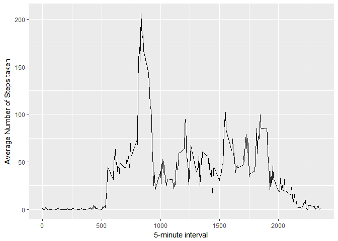
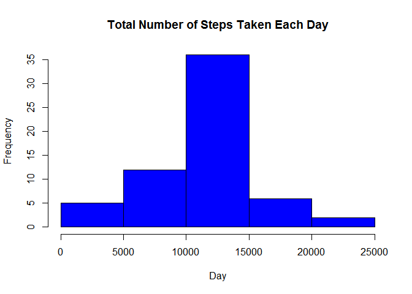
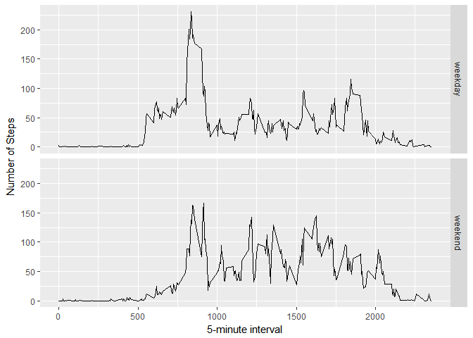

# Reproducible Research: Peer Assessment 1
Rajalakshmi Santhakumar  
## Synopsis

The purpose of this project was to practice:

- loading and preprocessing data
- imputing missing values
- interpreting data to answer research questions

## Data

The data for this assignment was downloaded from the coursera course web site:

- Dataset: [Activity monitoring data] (https://d396qusza40orc.cloudfront.net/repdata%2Fdata%2Factivity.zip) [52K]

The variables included in this dataset are:

- steps: Number of steps taking in a 5-minute interval (missing values are coded as NA)

- date: The date on which the measurement was taken in YYYY-MM-DD format

- interval: Identifier for the 5-minute interval in which measurement was taken

The dataset is stored in a comma-separated-value (CSV) file and there are a total of 17,568 observations in this dataset.

## Loading and preprocessing the data


```r
unzip(zipfile="activity.zip")
data <- read.csv("activity.csv")
```

## What is mean total number of steps taken per day?

First the total number of steps is calculated for each day.  Days without data are not represented for this part of the report. The following histogram represents its distribution:


```r
library(ggplot2)
data$date <- as.Date(data$date, "%Y-%m-%d")
Totalsteps <- tapply(data$steps, data$date, FUN=sum, na.rm=TRUE)
hist(Totalsteps, main="Total Number of Steps Taken Each Day", xlab="Day", col="blue")
```

<!-- -->
``

The Mean is: 

```
## [1] 9354.23
```

The Median is:

```
## [1] 10395
```

## What is the average daily activity pattern?


```r
library(ggplot2)
Avg <- aggregate(x=list(steps=data$steps), by=list(interval=data$interval),
                      FUN=mean, na.rm=TRUE)
g1<-ggplot(data=Avg, aes(x=interval, y=steps)) +
    geom_line() +
    xlab("5-minute interval") +
    ylab("Average Number of Steps taken")
print(g1)
```

<!-- -->

```r
Avg[which.max(Avg$steps),]
```

```
##     interval    steps
## 104      835 206.1698
```

## Imputing missing values

There are many days/intervals where there are missing values (coded as NA). The presence of missing days may introduce bias into some calculations or summaries of the data.


```r
missing <- is.na(data$steps)
# How many missing
table(missing)
```

```
## missing
## FALSE  TRUE 
## 15264  2304
```
All of the missing values are filled in with mean value for that 5-minute interval.


```r
# Replace each missing value with the mean value of its 5-minute interval
fill.value <- function(steps, interval) {
    filled <- NA
    if (!is.na(steps))
        filled <- c(steps)
    else
        filled <- (Avg[Avg$interval==interval, "steps"])
    return(filled)
}
filled.data <- data
filled.data$steps <- mapply(fill.value, filled.data$steps, filled.data$interval)
```

Now, using the filled data set: 

1. First, let's make a histogram of the total number of steps taken each day. 


```r
Totalsteps <- tapply(filled.data$steps, filled.data$date, FUN=sum)
hist(Totalsteps, main="Total Number of Steps Taken Each Day", xlab="Day", col="blue")
```

<!-- -->

Next, we will calculate the mean and median total number of steps.

```r
mean(Totalsteps)
median(Totalsteps)
```

The imputed data mean  is: 

```
## [1] 10766.19
```

The imputed data median is: 

```
## [1] 10766.19
```

Mean and median values are higher after imputing missing data. The reason is that in the original data, there are some days with steps values NA for any interval. The total number of steps taken in such days are set to 0s by default. However, after replacing missing steps values with the mean steps of associated interval value, these 0 values are removed from the histogram of total number of steps taken each day.

## Are there differences in activity patterns between weekdays and weekends?

First, let's find the day of the week for each measurement in the dataset. Then, we will make a panel plot containing plots of average number of steps taken on weekdays and weekends. In this part, we use the dataset with the filled-in values.


```r
Which.day <- function(date) {
    day <- weekdays(date)
    if (day %in% c("Monday", "Tuesday", "Wednesday", "Thursday", "Friday"))
        return("weekday")
    else if (day %in% c("Saturday", "Sunday"))
        return("weekend")
    else
        stop("invalid date")
}
filled.data$date <- as.Date(filled.data$date)
filled.data$day <- sapply(filled.data$date, FUN=Which.day)

Avg <- aggregate(steps ~ interval + day, data=filled.data, mean)
g2<-ggplot(Avg, aes(interval, steps)) + geom_line() + facet_grid(day ~ .) +
    xlab("5-minute interval") + ylab("Number of Steps")
print(g2)
```

<!-- -->
